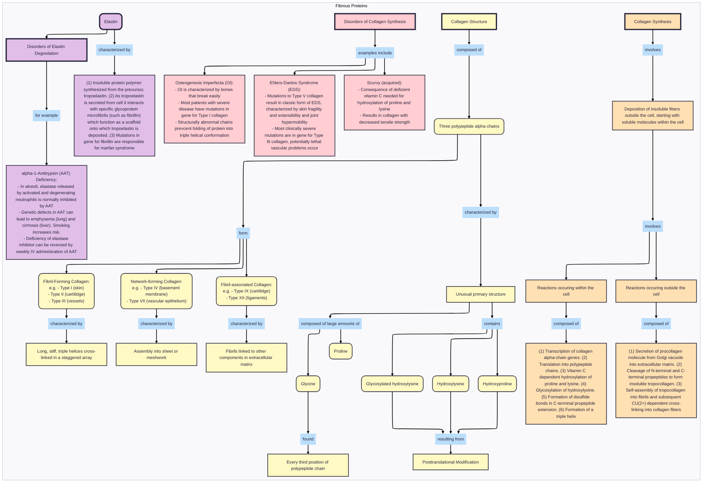

```mermaid
---
config:
  theme: redux
  layout: elk
---
flowchart TD
 subgraph s1["Fibrous Proteins"]
        n1["Collagen Structure"]
        n2["Collagen Synthesis"]
        n3["Disorders of Collagen Synthesis"]
        n4["composed of"]
        n5["involves"]
        n6["examples include"]
        n7["Three polypeptide alpha chains"]
        n8["form"]
        n9["characterized by"]
        n10["Unusual primary structure"]
        n11["Fibril-Forming Collagen:<br>e.g. - Type I (skin)<br>- Type II (cartilidge)<br>- Type III (vessels)"]
        n12["composed of large amounts of"]
        n13["Proline"]
        n14["Glycine"]
        n15["found"]
        n16["Every third position of polypeptide chain"]
        n17["contains"]
        n18["Hydroxyproline"]
        n19["Hydroxylysine"]
        n20["Glycosylated hydroxylysine"]
        n21["resulting from"]
        n22["Posttranslational Modification"]
        n23["Fibril-associated Collagen:<br>e.g. - Type IX (cartilidge)<br>- Type XII (ligaments)"]
        n24["Network-forming Collagen:<br>e.g. - Type IV (basement membrane)<br>- Type VII (vascular epithelium)"]
        n25["characterized by"]
        n26["Long, stiff, triple helices cross-linked in a staggered array"]
        n27["characterized by"]
        n28["Fibrils linked to other components in extracellular matrix"]
        n29["characterized by"]
        n30["Assembly into sheet or meshwork"]
        n31["Deposition of insoluble fibers outside the cell, starting with soluble molecules within the cell"]
        n32["involves"]
        n33["Reactions occuring within the cell"]
        n34["Reactions occuring outside the cell"]
        n35["composed of"]
        n36["composed of"]
        n37@{ label: "<span style=\"padding-left:\">(1) Transcription of collagen alpha-chain genes. (2) Translation into polypeptide chains. (3) Vitamin C dependent hydroxylation of proline and lysine. (4) Glycosylation of hydroxylysine. (5) Formation of disulfide bonds in C-terminal propeptide extension. (6) Formation of a triple helix</span>" }
        n38["(1) Secretion of procollagen molecule from Golgi vacuole into extracellular matrix. (2) Cleavage of N-terminal and C-terminal propeptides to form insoluble tropocollagen. (3) Self-assembly of tropocollagen into fibrils and subsequent CU(2+) dependent cross-linking into collagen fibers"]
        n39["Ehlers-Danlos Syndrome (EDS):<br>- Mutations to Type V collagen result in classic form of EDS, characterized by skin fragility and extensibility and joint hypermobility<br>- Most clinically severe mutations are in gene for Type III collagen, potentially lethal vascular problems occur"]
        n40["Osteogenesis Imperfecta (OI):<br>- OI is characterized by bones that break easily<br>- Most patients with severe disease have mutations in gene for Type I collagen<br>- Structurally abnormal chains prevcent folding of protein into triple helical conformation"]
        n41["Scurvy (acquired):<br>- Consequence of deficient vitamin C needed for hydroxylation of proline and lysine<br>- Results in collagen with decreased tensile strength"]
        n42["Elastin"]
        n43["characterized by"]
        n44["(1) Insoluble protein polymer synthesized from the precursor, tropoelastin. (2) As tropoelastin is secreted from cell it interacts with specific glycoprotein microfibrils (such as fibrillin) which function as a scaffold onto which tropoelastin is deposited. (3) Mutations in gene for fibrillin are responsible for marfan syndrome"]
        n45["Disorders of Elastin Degredation"]
        n46["for example"]
        n47["alpha-1-Antitrypsin (AAT) Deficiency:<br>- In alveoli, elastase released by activated and degenerating neutrophils is normally inhibited by AAT<br>- Genetic defects in AAT can lead to emphysema (lung) and cirrhosis (liver). Smoking increases risk.<br>- Deficiency of elastase inhibitor can be reversed by weekly IV administration of AAT"]
  end
    n1 --> n4
    n2 --> n5
    n3 --> n6
    n4 --> n7
    n7 --> n8 & n9
    n9 --> n10
    n8 --> n11 & n23 & n24
    n10 --> n12 & n17
    n12 --> n13 & n14
    n14 --> n15
    n15 --> n16
    n17 --> n18 & n19 & n20
    n18 --> n21
    n19 --> n21
    n20 --> n21
    n21 --> n22
    n11 --> n25
    n25 --> n26
    n23 --> n27
    n27 --> n28
    n24 --> n29
    n29 --> n30
    n5 --> n31
    n31 --> n32
    n32 --> n33 & n34
    n33 --> n35
    n34 --> n36
    n35 --> n37
    n36 --> n38
    n6 --> n39 & n40 & n41
    n42 --> n43 & n45
    n43 --> n44
    n45 --> n46
    n46 --> n47
    n4@{ shape: text}
    n5@{ shape: text}
    n6@{ shape: text}
    n7@{ shape: rounded}
    n8@{ shape: text}
    n9@{ shape: text}
    n11@{ shape: rounded}
    n12@{ shape: text}
    n13@{ shape: rounded}
    n14@{ shape: rounded}
    n15@{ shape: text}
    n17@{ shape: text}
    n18@{ shape: rounded}
    n19@{ shape: rounded}
    n20@{ shape: rounded}
    n21@{ shape: text}
    n23@{ shape: rounded}
    n24@{ shape: rounded}
    n25@{ shape: text}
    n27@{ shape: text}
    n29@{ shape: text}
    n32@{ shape: text}
    n35@{ shape: text}
    n36@{ shape: text}
    n37@{ shape: rect}
    n42@{ shape: rounded}
    n43@{ shape: text}
    n46@{ shape: text}
    style n1 fill:#FFF9C4,stroke-width:4px,stroke-dasharray: 0
    style n2 stroke-width:4px,stroke-dasharray: 0,fill:#FFE0B2
    style n3 stroke-width:4px,stroke-dasharray: 0,fill:#FFCDD2
    style n4 fill:#BBDEFB
    style n5 fill:#BBDEFB
    style n6 fill:#BBDEFB
    style n7 fill:#FFF9C4
    style n8 fill:#BBDEFB
    style n9 fill:#BBDEFB
    style n10 fill:#FFF9C4
    style n11 fill:#FFF9C4
    style n12 fill:#BBDEFB
    style n13 fill:#FFF9C4
    style n14 fill:#FFF9C4
    style n15 fill:#BBDEFB
    style n16 fill:#FFF9C4
    style n17 fill:#BBDEFB
    style n18 fill:#FFF9C4
    style n19 fill:#FFF9C4
    style n20 fill:#FFF9C4
    style n21 fill:#BBDEFB
    style n22 fill:#FFF9C4
    style n23 fill:#FFF9C4
    style n24 fill:#FFF9C4
    style n25 fill:#BBDEFB
    style n26 fill:#FFF9C4
    style n27 fill:#BBDEFB
    style n28 fill:#FFF9C4
    style n29 fill:#BBDEFB
    style n30 fill:#FFF9C4
    style n31 fill:#FFE0B2
    style n32 fill:#BBDEFB
    style n33 fill:#FFE0B2
    style n34 fill:#FFE0B2
    style n35 fill:#BBDEFB
    style n36 fill:#BBDEFB
    style n37 fill:#FFE0B2
    style n38 fill:#FFE0B2
    style n39 fill:#FFCDD2
    style n40 fill:#FFCDD2
    style n41 fill:#FFCDD2
    style n42 fill:#E1BEE7,stroke-width:4px,stroke-dasharray: 0
    style n43 fill:#BBDEFB
    style n44 fill:#E1BEE7
    style n45 fill:#E1BEE7,stroke-width:4px,stroke-dasharray: 0
    style n46 fill:#BBDEFB
    style n47 fill:#E1BEE7
```
