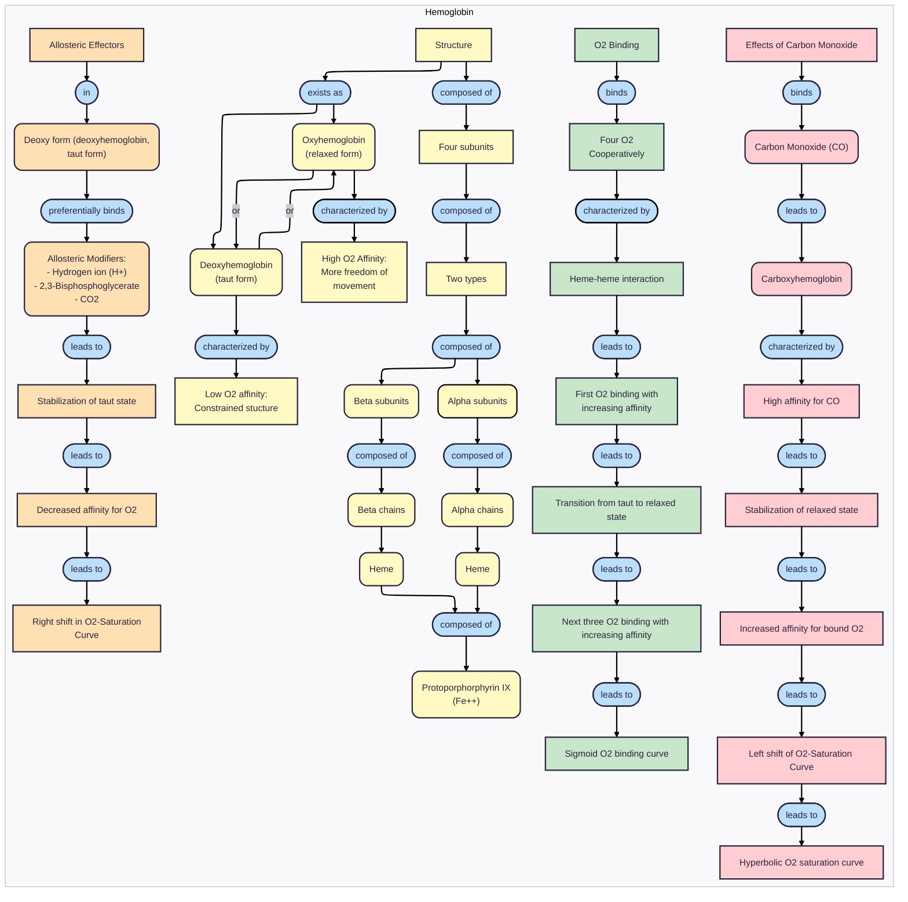

```mermaid
---
config:
  theme: redux
  layout: elk
---
flowchart TD
 subgraph s1["Hemoglobin"]
        n1["Structure"]
        n2["O2 Binding"]
        n3["Allosteric Effectors"]
        n4["Effects of Carbon Monoxide"]
        n5(["composed of"])
        n6(["exists as"])
        n7(["binds"])
        n8(["in"])
        n9(["binds"])
        n10["Deoxyhemoglobin<br>(taut form)"]
        n11["Oxyhemoglobin<br>(relaxed form)"]
        n12(["characterized by"])
        n13(["characterized by"])
        n14["High O2 Affinity:<br>More freedom of<br>movement"]
        n15@{ label: "<span style=\"padding-left:\">Low O2 affinity:<br>Constrained stucture</span>" }
        n16["Four subunits"]
        n17(["composed of"])
        n18["Two types"]
        n19(["composed of"])
        n20["Beta subunits"]
        n21["Alpha subunits"]
        n22(["composed of"])
        n23(["composed of"])
        n24["Beta chains"]
        n25["Alpha chains"]
        n26["Heme"]
        n27["Heme"]
        n28(["composed of"])
        n29["Protoporphorphyrin IX<br>(Fe++)"]
        n30["Four O2<br>Cooperatively"]
        n31(["characterized by"])
        n32["Heme-heme interaction"]
        n33(["leads to"])
        n34["First O2 binding with<br>increasing affinity"]
        n35(["leads to"])
        n36["Transition from taut to relaxed state"]
        n37(["leads to"])
        n38["Next three O2 binding with increasing affinity"]
        n39(["leads to"])
        n40["Sigmoid O2 binding curve"]
        n41["Deoxy form (deoxyhemoglobin,<br>taut form)"]
        n42(["preferentially binds"])
        n43["Allosteric Modifiers:<br>- Hydrogen ion (H+)<br>- 2,3-Bisphosphoglycerate<br>- CO2"]
        n44(["leads to"])
        n45["Stabilization of taut state"]
        n46(["leads to"])
        n47["Decreased affinity for O2"]
        n48(["leads to"])
        n49["Right shift in O2-Saturation<br>Curve"]
        n50["Carbon Monoxide (CO)"]
        n51(["leads to"])
        n52["Carboxyhemoglobin"]
        n53(["characterized by"])
        n54["High affinity for CO"]
        n55(["leads to"])
        n56["Stabilization of relaxed state"]
        n57(["leads to"])
        n58["Increased affinity for bound O2"]
        n59(["leads to"])
        n60["Left shift of O2-Saturation Curve"]
        n61(["leads to"])
        n62["Hyperbolic O2 saturation curve"]
  end
    n1 --> n5 & n6
    n2 --> n7
    n3 --> n8
    n4 --> n9
    n6 --> n10 & n11
    n10 --> n12
    n10 -- or --> n11
    n11 -- or --> n10
    n11 --> n13
    n13 --> n14
    n12 --> n15
    n5 --> n16
    n16 --> n17
    n17 --> n18
    n18 --> n19
    n19 --> n20 & n21
    n21 --> n22
    n20 --> n23
    n23 --> n24
    n22 --> n25
    n25 --> n26
    n24 --> n27
    n26 --> n28
    n27 --> n28
    n28 --> n29
    n7 --> n30
    n30 --> n31
    n31 --> n32
    n32 --> n33
    n33 --> n34
    n34 --> n35
    n35 --> n36
    n36 --> n37
    n37 --> n38
    n38 --> n39
    n39 --> n40
    n8 --> n41
    n41 --> n42
    n42 --> n43
    n43 --> n44
    n44 --> n45
    n45 --> n46
    n46 --> n47
    n47 --> n48
    n48 --> n49
    n9 --> n50
    n50 --> n51
    n51 --> n52
    n52 --> n53
    n53 --> n54
    n54 --> n55
    n55 --> n56
    n56 --> n57
    n57 --> n58
    n58 --> n59
    n59 --> n60
    n60 --> n61
    n61 --> n62
    n10@{ shape: rounded}
    n11@{ shape: rounded}
    n15@{ shape: rect}
    n20@{ shape: rounded}
    n21@{ shape: rounded}
    n24@{ shape: rounded}
    n25@{ shape: rounded}
    n26@{ shape: rounded}
    n27@{ shape: rounded}
    n29@{ shape: rounded}
    n30@{ shape: rect}
    n32@{ shape: rect}
    n41@{ shape: rounded}
    n43@{ shape: rounded}
    n50@{ shape: rounded}
    n52@{ shape: rounded}
    style n1 fill:#FFF9C4
    style n2 fill:#C8E6C9
    style n3 fill:#FFE0B2
    style n4 fill:#FFCDD2
    style n5 fill:#BBDEFB
    style n6 fill:#BBDEFB
    style n7 fill:#BBDEFB
    style n8 fill:#BBDEFB
    style n9 fill:#BBDEFB
    style n10 fill:#FFF9C4
    style n11 fill:#FFF9C4
    style n12 fill:#BBDEFB
    style n13 stroke:#000000,fill:#BBDEFB
    style n14 fill:#FFF9C4
    style n15 fill:#FFF9C4
    style n16 fill:#FFF9C4
    style n17 fill:#BBDEFB
    style n18 fill:#FFF9C4
    style n19 fill:#BBDEFB
    style n20 fill:#FFF9C4
    style n21 stroke:#000000,fill:#FFF9C4
    style n22 fill:#BBDEFB
    style n23 fill:#BBDEFB
    style n24 fill:#FFF9C4
    style n25 fill:#FFF9C4
    style n26 fill:#FFF9C4
    style n27 fill:#FFF9C4
    style n28 fill:#BBDEFB
    style n29 fill:#FFF9C4
    style n30 fill:#C8E6C9
    style n31 stroke:#000000,fill:#BBDEFB
    style n32 fill:#C8E6C9
    style n33 fill:#BBDEFB
    style n34 fill:#C8E6C9
    style n35 fill:#BBDEFB
    style n36 fill:#C8E6C9
    style n37 fill:#BBDEFB
    style n38 fill:#C8E6C9
    style n39 fill:#BBDEFB
    style n40 fill:#C8E6C9
    style n41 fill:#FFE0B2
    style n42 fill:#BBDEFB
    style n43 fill:#FFE0B2
    style n44 fill:#BBDEFB
    style n45 fill:#FFE0B2
    style n46 fill:#BBDEFB
    style n47 fill:#FFE0B2
    style n48 fill:#BBDEFB
    style n49 fill:#FFE0B2
    style n50 fill:#FFCDD2
    style n51 fill:#BBDEFB
    style n52 fill:#FFCDD2
    style n53 fill:#BBDEFB
    style n54 fill:#FFCDD2
    style n55 fill:#BBDEFB
    style n56 fill:#FFCDD2
    style n57 fill:#BBDEFB
    style n58 fill:#FFCDD2
    style n59 fill:#BBDEFB
    style n60 fill:#FFCDD2
    style n61 fill:#BBDEFB
    style n62 fill:#FFCDD2
```
