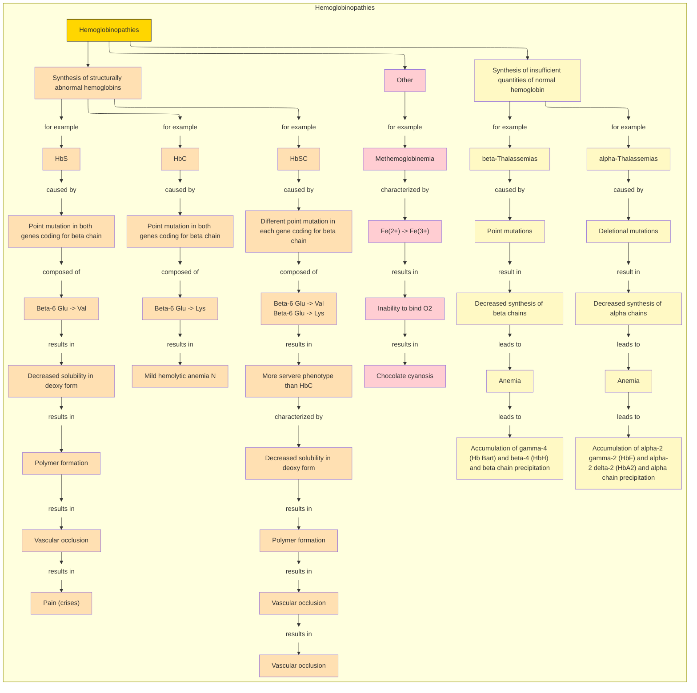

```mermaid
---
config:
  theme: default
  layout: elk
---
flowchart TD
 subgraph s1["Hemoglobinopathies"]
        n1["Hemoglobinopathies"]
        n2["Synthesis of insufficient quantities of normal hemoglobin"]
        n3["Other"]
        n4["Synthesis of structurally abnormal hemoglobins"]
        n5["for example"]
        n6["for example"]
        n7["for example"]
        n8["HbS"]
        n9["HbC"]
        n10["HbSC"]
        n11["caused by"]
        n12["caused by"]
        n13["caused by"]
        n14["Different point mutation in each gene coding for beta chain"]
        n15["Point mutation in both genes coding for beta chain"]
        n16["Point mutation in both genes coding for beta chain"]
        n17["composed of"]
        n18["composed of"]
        n19["composed of"]
        n20["Beta-6 Glu -&gt; Val"]
        n21["Beta-6 Glu -&gt; Lys"]
        n22["Beta-6 Glu -&gt; Val<br>Beta-6 Glu -&gt; Lys"]
        n23["results in"]
        n24["results in"]
        n25["results in"]
        n26["Decreased solubility in deoxy form"]
        n27["Mild hemolytic anemia N"]
        n28["More servere phenotype than HbC"]
        n29["characterized by"]
        n30["results in"]
        n31["Polymer formation"]
        n32["results in"]
        n33["Vascular occlusion"]
        n34["results in"]
        n35["Pain (crises)"]
        n36["Decreased solubility in deoxy form"]
        n37["results in"]
        n38["Polymer formation"]
        n39["results in"]
        n40["Vascular occlusion"]
        n41["results in"]
        n42["for example"]
        n43["for example"]
        n44["beta-Thalassemias"]
        n45["alpha-Thalassemias"]
        n46["caused by"]
        n47["caused by"]
        n48["Vascular occlusion"]
        n49["Deletional mutations"]
        n50["Point mutations"]
        n51["result in"]
        n52["result in"]
        n53["Decreased synthesis of alpha chains"]
        n54["Decreased synthesis of beta chains"]
        n55["leads to"]
        n56["leads to"]
        n57["Anemia"]
        n58["Anemia"]
        n59["leads to"]
        n60["leads to"]
        n61["Accumulation of gamma-4 (Hb Bart) and beta-4 (HbH) and beta chain precipitation"]
        n62["Accumulation of alpha-2 gamma-2 (HbF) and alpha-2 delta-2 (HbA2) and alpha chain precipitation"]
        n63["for example"]
        n64["Methemoglobinemia"]
        n65["characterized by"]
        n66["Fe(2+) -&gt; Fe(3+)"]
        n67["results in"]
        n68["Inability to bind O2"]
        n69["results in"]
        n70["Chocolate cyanosis"]
  end
    n1 --> n2 & n3 & n4
    n4 --> n5 & n6 & n7
    n7 --> n8
    n5 --> n9
    n6 --> n10
    n8 --> n11
    n9 --> n12
    n10 --> n13
    n13 --> n14
    n12 --> n15
    n11 --> n16
    n16 --> n17
    n15 --> n18
    n14 --> n19
    n17 --> n20
    n18 --> n21
    n19 --> n22
    n20 --> n23
    n21 --> n24
    n22 --> n25
    n23 --> n26
    n24 --> n27
    n25 --> n28
    n28 --> n29
    n26 --> n30
    n30 --> n31
    n31 --> n32
    n32 --> n33
    n33 --> n34
    n34 --> n35
    n29 --> n36
    n36 --> n37
    n37 --> n38
    n38 --> n39
    n39 --> n40
    n40 --> n41
    n2 --> n42 & n43
    n42 --> n44
    n43 --> n45
    n45 --> n46
    n44 --> n47
    n41 --> n48
    n46 --> n49
    n47 --> n50
    n49 --> n51
    n50 --> n52
    n51 --> n53
    n52 --> n54
    n53 --> n55
    n54 --> n56
    n56 --> n57
    n55 --> n58
    n57 --> n59
    n58 --> n60
    n59 --> n61
    n60 --> n62
    n3 --> n63
    n63 --> n64
    n64 --> n65
    n65 --> n66
    n66 --> n67
    n67 --> n68
    n68 --> n69
    n69 --> n70
    n5@{ shape: text}
    n6@{ shape: text}
    n7@{ shape: text}
    n11@{ shape: text}
    n12@{ shape: text}
    n13@{ shape: text}
    n17@{ shape: text}
    n18@{ shape: text}
    n19@{ shape: text}
    n23@{ shape: text}
    n24@{ shape: text}
    n25@{ shape: text}
    n29@{ shape: text}
    n30@{ shape: text}
    n32@{ shape: text}
    n33@{ shape: rect}
    n34@{ shape: text}
    n37@{ shape: text}
    n39@{ shape: text}
    n41@{ shape: text}
    n42@{ shape: text}
    n43@{ shape: text}
    n46@{ shape: text}
    n47@{ shape: text}
    n51@{ shape: text}
    n52@{ shape: text}
    n55@{ shape: text}
    n56@{ shape: text}
    n59@{ shape: text}
    n60@{ shape: text}
    n63@{ shape: text}
    n65@{ shape: text}
    n67@{ shape: text}
    n69@{ shape: text}
    style n1 fill:#FFD600,stroke:#000000
    style n2 fill:#FFF9C4
    style n3 fill:#FFCDD2
    style n4 fill:#FFE0B2
    style n8 fill:#FFE0B2
    style n9 fill:#FFE0B2
    style n10 fill:#FFE0B2
    style n14 fill:#FFE0B2
    style n15 fill:#FFE0B2
    style n16 fill:#FFE0B2
    style n20 fill:#FFE0B2
    style n21 fill:#FFE0B2
    style n22 fill:#FFE0B2
    style n26 fill:#FFE0B2
    style n27 fill:#FFE0B2
    style n28 fill:#FFE0B2
    style n31 fill:#FFE0B2
    style n33 fill:#FFE0B2
    style n35 fill:#FFE0B2
    style n36 fill:#FFE0B2
    style n38 fill:#FFE0B2
    style n40 fill:#FFE0B2
    style n44 fill:#FFF9C4
    style n45 fill:#FFF9C4
    style n48 fill:#FFE0B2
    style n49 fill:#FFF9C4
    style n50 fill:#FFF9C4
    style n53 fill:#FFF9C4
    style n54 fill:#FFF9C4
    style n57 fill:#FFF9C4
    style n58 fill:#FFF9C4
    style n61 fill:#FFF9C4
    style n62 fill:#FFF9C4
    style n64 fill:#FFCDD2
    style n66 fill:#FFCDD2
    style n68 fill:#FFCDD2
    style n70 fill:#FFCDD2
```
