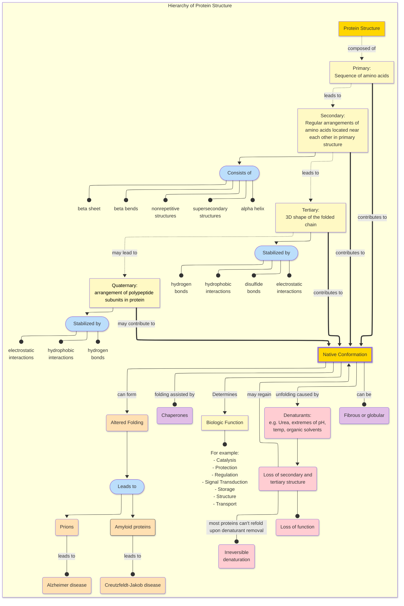

```mermaid
---
config:
  theme: default
  layout: elk
  look: neo
---
flowchart TD
 subgraph s1["Hierarchy of Protein Structure"]
        n1["Protein Structure"]
        n2["Primary:<br>Sequence of amino acids"]
        n3["Secondary:<br>Regular arrangements of amino acids located near each other in primary structure"]
        n5["Native Conformation"]
        n6["Tertiary:<br>3D shape of the folded chain"]
        n7["Quaternary:<br>arrangement of polypeptide subunits in protein"]
        n9(["Consists of"])
        n10(["Stabilized by"])
        n11(["Stabilized by"])
        n12["Biologic Function"]
        n13["alpha helix"]
        n14["beta sheet"]
        n15["beta bends"]
        n16["nonrepetitive<br>structures"]
        n17["supersecondary<br>structures"]
        n18["For example:<br>- Catalysis<br>- Protection<br>- Regulation<br>- Signal Transduction<br>- Storage<br>- Structure<br>- Transport"]
        n19["hydrophobic<br>interactions"]
        n20["hydrogen<br>bonds"]
        n21["electrostatic<br>interactions"]
        n22["disulfide<br>bonds"]
        n23["hydrophobic<br>interactions"]
        n24["hydrogen<br>bonds"]
        n25["electrostatic<br>interactions"]
        n26["Fibrous or globular"]
        n27["Chaperones"]
        n28["Denaturants:<br>e.g. Urea, extremes of pH,<br>temp, organic solvents"]
        n29["Loss of secondary and<br>tertiary structure"]
        n30["Loss of function"]
        n31["Irreversible<br>denaturation"]
        n32["Altered Folding"]
        n33(["Leads to"])
        n34["Prions"]
        n35["Amyloid proteins"]
        n36["Creutzfeldt-Jakob disease"]
        n37["Alzheimer disease"]
  end
    n1 -. composed of .-> n2
    n2 == contributes to ==> n5
    n2 -. leads to .-> n3
    n3 == contributes to ==> n5
    n3 -. leads to .-> n6
    n6 == contributes to ==> n5
    n6 -. may lead to .-> n7
    n7 == may contribute to ==> n5
    n3 --> n9
    n6 --> n10
    n7 --> n11
    n5 -- Determines --> n12
    n9 --o n13 & n16 & n17 & n15 & n14
    n12 --o n18
    n10 --o n19 & n20 & n21 & n22
    n11 --o n23 & n24 & n25
    n5 -- can be --o n26
    n5 -- folding assisted by --o n27
    n5 -- can form --> n32
    n5 -- unfolding caused by --> n28
    n28 --> n29
    n29 --o n30
    n29 -- most proteins can't refold upon denaturant removal --o n31
    n29 -- may regain --> n5
    n32 --> n33
    n33 --> n34 & n35
    n35 -- leads to --o n36
    n34 -- leads to --o n37
    n13@{ shape: text}
    n14@{ shape: text}
    n15@{ shape: text}
    n16@{ shape: text}
    n17@{ shape: text}
    n18@{ shape: text}
    n19@{ shape: text}
    n20@{ shape: text}
    n21@{ shape: text}
    n22@{ shape: text}
    n23@{ shape: text}
    n24@{ shape: text}
    n25@{ shape: text}
    n26@{ shape: rounded}
    n27@{ shape: rounded}
    n28@{ shape: rounded}
    n29@{ shape: rounded}
    n30@{ shape: rounded}
    n31@{ shape: rounded}
    n32@{ shape: rounded}
    n34@{ shape: rounded}
    n35@{ shape: rounded}
    n36@{ shape: rounded}
    n37@{ shape: rounded}
    style n1 fill:#FFD600
    style n2 fill:#FFF9C4
    style n3 fill:#FFF9C4
    style n5 fill:#FFD600,stroke-width:4px,stroke-dasharray: 0
    style n6 fill:#FFF9C4
    style n7 fill:#FFF9C4,color:#000000
    style n9 fill:#BBDEFB
    style n10 fill:#BBDEFB
    style n11 fill:#BBDEFB
    style n12 fill:#FFF9C4
    style n26 fill:#E1BEE7
    style n27 fill:#E1BEE7
    style n28 fill:#FFCDD2
    style n29 fill:#FFCDD2
    style n30 fill:#FFCDD2
    style n31 fill:#FFCDD2
    style n32 fill:#FFE0B2
    style n33 fill:#BBDEFB
    style n34 fill:#FFE0B2
    style n35 stroke:#424242,fill:#FFE0B2
    style n36 fill:#FFE0B2
    style n37 fill:#FFE0B2
```
